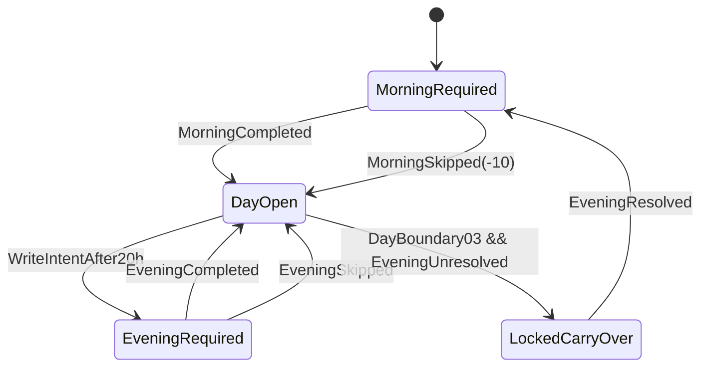
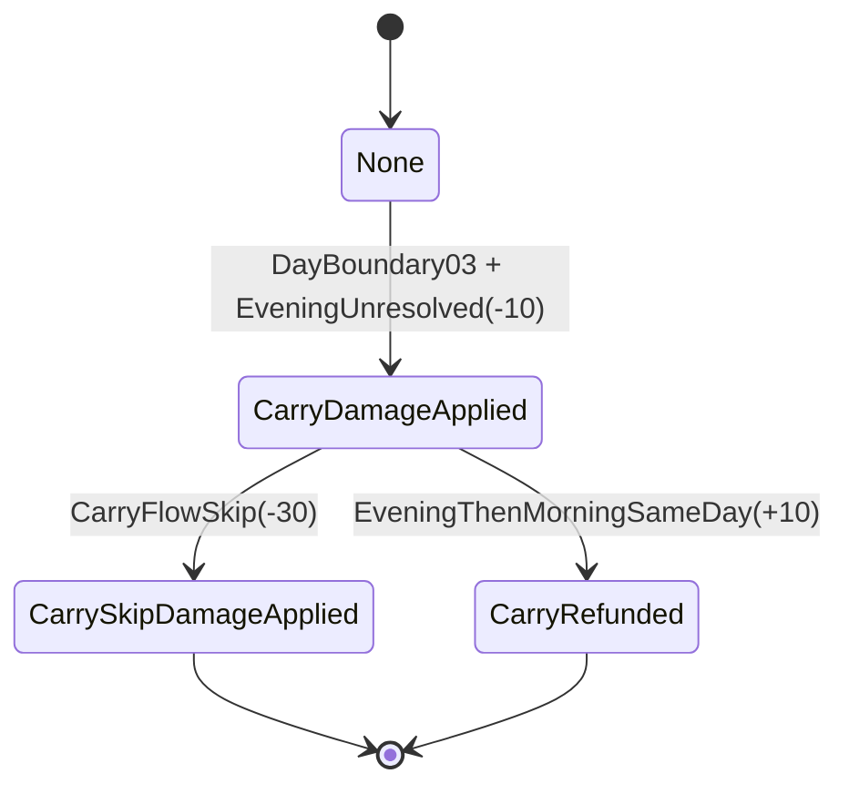
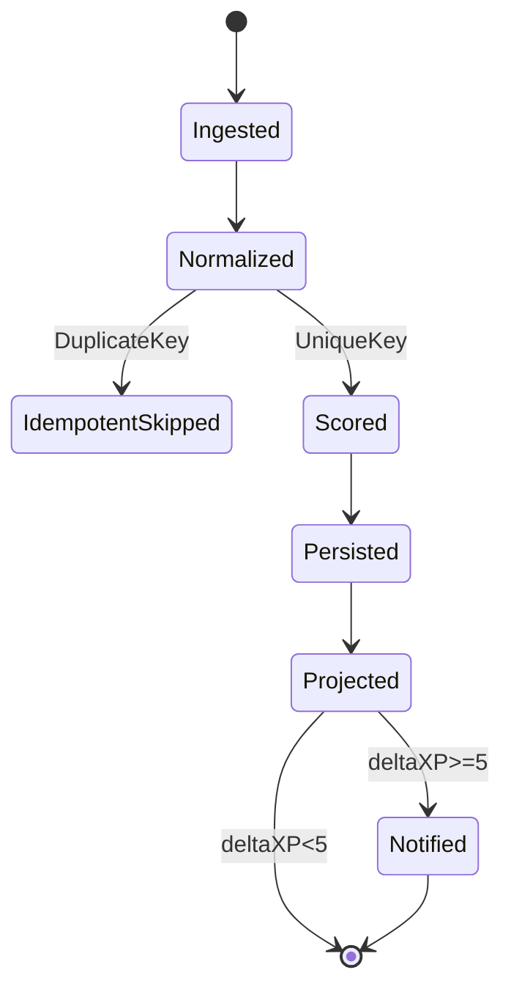

# XP Engine v2 Implementation Scaffold (Decision-Complete)

## Document Control
- Status: `implementation-ready`
- Date: `2026-02-14`
- Scope: Unified personal XP engine across capture, briefs, tasks, command lifecycle, and 03:00 rollover.
- Non-goals: new HTTP endpoints, legacy UI migration, visual redesign.

## 0. Locked Assumptions
1. Runtime is single-user and local-timezone authoritative.
2. Day boundary is fixed to `03:00 local` for all day-key calculations.
3. API contract policy is additive-only on existing endpoints (`/api/capture`, `/api/status`).
4. Existing economy anchors remain fixed: `plannedEEU 1..1000`, `progressPct 0..100`, `softStart=1200`, `hardCap=2500`, shared damped XP/coins conversion.
5. XP notification policy is fixed: only emit gain notifications for `deltaXP >= +5`.
6. Morning/Evening brief gate behavior and carry-over penalties are fixed:
   - Morning skip: `-10 XP`
   - Carry unresolved damage: `-10 XP`
   - Carry-flow skip damage: `-30 XP`
   - Carry damage refund: `+10 XP` if Evening->Morning resolved same day.
7. LocalStorage key `alfred_workquest_v1` must remain fully backward-compatible.

## 1. Domain Model and Module Boundaries

## 1.1 Module Boundaries
- `alfred/xp-engine/core/`
  - Pure deterministic domain logic, no file I/O.
  - `normalization.js`, `scoring.js`, `brief-gates.js`, `settlement.js`, `projection.js`, `invariants.js`.
- `alfred/xp-engine/runtime/`
  - Orchestration + persistence adapters.
  - `ingest.js`, `persist.js`, `idempotency.js`, `status-projection.js`, `capture-projection.js`.
- `alfred/xp-engine/store/`
  - File-backed data access.
  - `xp-ledger.jsonl`, `xp-day-snapshots.json`, `xp-idempotency.json`, `xp-audit.jsonl`.
- `chatui/src/lib/xp-engine/`
  - Read-model + UI diff helpers.
  - `kpi-diff.ts`, `notification-filter.ts`, `snapshot-cache.ts`.

## 1.2 Core Domain Objects
- `XPEvent`: canonical input event for scoring.
- `DayContext`: day-keyed aggregate state (`03:00 local` boundary).
- `BriefGateState`: finite gate state (`locked_carry_over`, `morning_required`, `day_open`, `evening_required`).
- `EEUClaimState`: per-ticket progress claim tracking (`lastProgressPct`, `claimsToday`, `awardedEEUToday`).
- `XPScore`: deterministic scoring result for one event.
- `XPSnapshot`: materialized KPI state used by `/api/status`.
- `XPAuditEntry`: append-only decision log for replay/debug.

## 1.3 Invariants (Must Never Be Violated)
1. `progressPct` is monotonic per ticket/day for rewarding; regressions produce `deltaProgress=0`.
2. Effective daily EEU never exceeds `hardCap=2500`.
3. No event may be scored twice for the same `idempotencyKey`.
4. `dayKey` must be derived only with boundary-shifted local date (`timestamp - 3h`).
5. Carry-over sequence is strictly `Evening -> Morning` before writing unlock.

## 2. Type and Interface Contracts

## 2.1 Input Event Schema
```ts
type XPInputEvent = {
  eventId: string; // uuid/ulid
  idempotencyKey: string; // stable across retries for same intent
  source: 'capture' | 'brief' | 'task' | 'command' | 'scheduler' | 'system';
  sourceRef: string; // captureId, briefId, commandId, cronRunId
  occurredAt: string; // ISO timestamp
  ingestedAt: string; // ISO timestamp
  timezone: string; // IANA timezone
  dayKey: string; // derived from occurredAt and 03:00 boundary
  type:
    | 'TICKET_PROGRESS_CLAIMED'
    | 'CAPTURE_WRITTEN'
    | 'TASK_COMPLETED'
    | 'MILESTONE_COMPLETED'
    | 'MORNING_BRIEF_COMPLETED'
    | 'MORNING_BRIEF_SKIPPED'
    | 'EVENING_BRIEF_COMPLETED'
    | 'EVENING_BRIEF_SKIPPED'
    | 'CARRY_OVER_APPLIED'
    | 'CARRY_OVER_REFUNDED'
    | 'DAY_BOUNDARY_03';
  payload: Record<string, unknown>;
};
```

### Event Payload Rules
- `TICKET_PROGRESS_CLAIMED`: `{ ticketId, plannedEEU, progressPct, taskType }`
- `CAPTURE_WRITTEN`: `{ words, promptCount, category }`
- `TASK_COMPLETED`: `{ taskId, taskType, priority }`
- `MILESTONE_COMPLETED`: `{ milestoneId, class }`
- `MORNING_BRIEF_COMPLETED`: `{ expectedDifficulty, expectedXP, mood, tag }`
- `MORNING_BRIEF_SKIPPED`: `{ skipReason }`
- `EVENING_BRIEF_COMPLETED`: `{ title, reflectionWords, actualDifficulty }`
- `EVENING_BRIEF_SKIPPED`: `{ skipReason }`
- `CARRY_OVER_APPLIED`: `{ reason: 'evening_unresolved' }`
- `CARRY_OVER_REFUNDED`: `{ reason: 'same_day_resolution' }`
- `DAY_BOUNDARY_03`: `{ fromDayKey, toDayKey }`

## 2.2 Derived Metrics Schema
```ts
type XPDerivedMetrics = {
  eventId: string;
  dayKey: string;
  deltaProgressPct: number; // 0..100
  deltaEEU: number; // from progress delta claim
  deltaXU: number; // writing/task/milestone effort units
  rawEffort: number; // deltaEEU + deltaXU
  repeatFactor: number; // anti-spam on repeated ticket claims
  softFactor: number; // diminishing returns after softStart
  effectiveEffort: number; // capped and damped effort
  expectedDifficulty: number | null; // 1..100
  expectedXP: number | null; // 0..1000
  actualDifficultyRolling: number; // provisional 1..100
  capRemainingBefore: number;
  capRemainingAfter: number;
};
```

## 2.3 Scoring Output Schema
```ts
type XPScoreOutput = {
  scoreId: string;
  eventId: string;
  dayKey: string;
  baseXP: number;
  baseCoins: number;
  multiplier: number; // fixed range 0.70..1.30
  penaltyXP: number; // <= 0
  refundXP: number; // >= 0
  deltaXP: number; // final
  deltaCoins: number; // final
  blocked: boolean;
  flags: Array<'cap_reached' | 'high_slider' | 'rapid_claims' | 'manual_review'>;
  notificationEligible: boolean; // true iff deltaXP >= 5
  notificationContext: Array<'words' | 'task' | 'milestone' | 'expectedXP-goal'>;
};
```

## 2.4 Audit Event Schema
```ts
type XPAuditEvent = {
  auditId: string;
  ts: string;
  level: 'info' | 'warn' | 'error';
  eventId: string | null;
  stage:
    | 'INGESTED'
    | 'NORMALIZED'
    | 'IDEMPOTENT_SKIPPED'
    | 'SCORED'
    | 'PERSISTED'
    | 'PROJECTED'
    | 'NOTIFIED'
    | 'SETTLED';
  decision: string; // machine-readable token
  reason: string; // short explanation
  beforeHash: string | null;
  afterHash: string | null;
  data: Record<string, unknown>;
};
```

## 3. State Machines

## 3.1 Brief Gates


## 3.2 Carry-Over Penalty Flow


## 3.3 Scoring Lifecycle


## 3.4 Notification Lifecycle
- `candidate` -> `suppressed` when `deltaXP < +5` or not a gain.
- `candidate` -> `aggregated` by `(dayKey, sourceContext)`.
- `aggregated` -> `emitted` with `remainingToExpectedXP`.
- `emitted` -> `acknowledged` on click.
- `acknowledged` -> `cleared` only by explicit user action.

## 4. Computation Pipeline
1. Ingestion
   - Receive event from capture/brief/task/scheduler adapters.
   - Assign deterministic `eventId` and `idempotencyKey`.
2. Normalization
   - Validate schema and clamp ranges.
   - Compute `dayKey` using `03:00 local` boundary.
3. Scoring
   - Derive metrics (`deltaEEU`, `deltaXU`, factors).
   - Compute XP/coins using shared damped curve.
   - Apply penalties/refunds and multiplier.
4. Persistence
   - Append `xp-ledger.jsonl` score entry.
   - Update `xp-day-snapshots.json` materialized day snapshot.
   - Update `xp-idempotency.json`.
   - Append `xp-audit.jsonl`.
5. UI Projection
   - Inject `xpEngine` additive block into `/api/status`.
   - Return additive score summary in `/api/capture` (`economyEffect` compatibility mapping + `xpEngineEffect`).
6. Client Diff/Notify
   - Poll every `60s`.
   - Compute metric diffs against previous snapshot.
   - Emit UI notification only for `deltaXP >= +5`.

## 5. Determinism and Idempotency Strategy

## 5.1 Determinism Rules
- All formulas are pure functions of normalized input + snapshot before-state.
- No random values in scoring path.
- Event ordering is fixed: `(occurredAt asc, ingestedAt asc, eventId asc)`.
- Settlement recomputation reads only persisted ledger entries.

## 5.2 Idempotency Rules
- `idempotencyKey` required for every event.
- If key exists in `xp-idempotency.json`, skip scoring and emit `IDEMPOTENT_SKIPPED` audit event.
- Idempotency TTL: `45 days` (same as day snapshot retention horizon).
- Replay mode uses same keys and must produce byte-stable output.

## 6. Backward Compatibility Strategy

## 6.1 LocalStorage (`alfred_workquest_v1`)
- Keep key name unchanged.
- Add optional nested block:
```json
{
  "engineV2": {
    "enabled": true,
    "lastDayKey": "YYYY-MM-DD",
    "lastSnapshotHash": "..."
  }
}
```
- Hydration strategy:
  - missing `engineV2` => initialize defaults.
  - malformed `engineV2` => ignore block, keep legacy state.
  - never remove or rename existing legacy fields.

## 6.2 Existing Payload Compatibility
- `/api/capture`
  - Keep existing `economyEffect` and `economy` fields.
  - Additive field: `xpEngineEffect`.
- `/api/status`
  - Keep current shape unchanged.
  - Additive field: `xpEngine` with snapshots, gate states, and notification candidates.

## 6.3 Compatibility Mapping Contract
- New engine writes both:
  - authoritative v2 ledger/snapshot.
  - compatibility projection into existing economy response fields.

## 7. Test Scaffold

## 7.1 Unit Tests
- `alfred/xp-engine/core/__tests__/normalization.test.js`
- `alfred/xp-engine/core/__tests__/scoring.test.js`
- `alfred/xp-engine/core/__tests__/brief-gates.test.js`
- `alfred/xp-engine/core/__tests__/settlement.test.js`
- Focus:
  - clamps and invariants
  - cap behavior
  - penalty/refund constants
  - multiplier boundaries

## 7.2 Integration Tests
- `alfred/xp-engine/runtime/__tests__/capture-flow.integration.test.js`
- `alfred/xp-engine/runtime/__tests__/status-projection.integration.test.js`
- `alfred/xp-engine/runtime/__tests__/carry-over.integration.test.js`
- Focus:
  - `/api/capture -> ledger -> /api/status` coherence
  - gate enforcement sequence
  - additive contract compatibility

## 7.3 Replay Tests
- `alfred/xp-engine/runtime/__tests__/replay.determinism.test.js`
- Use frozen event fixture set from real JSONL.
- Run same stream twice and assert:
  - identical ledger entries
  - identical snapshots
  - identical audit hashes

## 7.4 Adversarial Tests
- duplicate idempotency keys flood
- out-of-order events
- progress rollback attempts
- DST boundary around `03:00 local`
- rapid claims with high slider values near cap

## 8. Rollout Plan

## 8.1 Phase A: Shadow Mode (7 days)
- Compute v2 scores in parallel, do not affect user-facing XP totals.
- Persist v2 artifacts and drift report per day.
- Exit gate:
  - zero invariant violations
  - zero parser regressions on legacy state

## 8.2 Phase B: Compare Mode (3 days)
- Expose both legacy and v2 metrics in `/api/status.xpEngine.compare`.
- Highlight deltas in internal debug panel only.
- Exit gate:
  - unexplained score drift < 0.5%
  - no idempotency misses

## 8.3 Phase C: Activation
- Switch authority to v2 for XP/coins minting.
- Keep legacy compatibility projection active for 14 days.
- Rollback switch: env flag `XP_ENGINE_V2_ENABLED=0` returns to legacy authority.

## 9. Observability Plan

## 9.1 Logs (Append-Only)
- ingestion decisions (`accepted`, `rejected`, `duplicate`)
- scoring outcomes (`deltaXP`, `deltaCoins`, flags)
- gate transitions and penalties/refunds
- settlement adjustments at day-close

## 9.2 Metrics
- `xp_events_total{type}`
- `xp_idempotent_skips_total`
- `xp_scoring_latency_ms`
- `xp_daily_cap_hits_total`
- `xp_penalties_total{kind}`
- `xp_refunds_total{kind}`
- `xp_notifications_emitted_total`
- `xp_notifications_suppressed_total{reason}`

## 9.3 Why This Is Required
- Detect inflation, spam, and cap abuse early.
- Prove deterministic behavior under replay.
- Keep gate/penalty UX auditable and explainable.
- Validate notification noise policy (`>= +5 XP`).

## 10. Risks and Mitigation Table

| Risk | Impact | Mitigation |
| --- | --- | --- |
| Day-key bug around DST/03:00 | Wrong day scoring/penalties | Single boundary utility + timezone fixtures |
| Duplicate processing | XP inflation | Hard idempotency index + skip audit |
| Out-of-order ingest | Nondeterministic totals | Stable ordering rule + settlement recompute |
| Carry-over gate deadlock | User blocked from writing | Explicit transition guard + integration tests |
| Legacy localStorage breakage | Progress loss | Additive schema only + safe hydration fallback |
| Notification spam | Reduced trust | hard threshold `deltaXP>=5`, aggregation by context |
| Hidden scoring drift | Operator confusion | shadow/compare rollout with drift report |

## 11. Implementation Checklist (Execution Order)
1. Create module folders and core skeleton files (`core`, `runtime`, `store`).
2. Implement normalization + invariants + idempotency guard.
3. Implement scoring formulas and penalty/refund rules.
4. Implement brief gate and carry-over state machines.
5. Wire persistence (`ledger`, `snapshot`, `audit`).
6. Add additive projections to `/api/capture` and `/api/status`.
7. Add client KPI diff helper and notification filter for `>= +5`.
8. Add replay + adversarial test suites.
9. Run shadow mode, then compare mode, then activation.

## 12. Acceptance Criteria
- All tests in sections 7.1-7.4 passing.
- `npm run build` passing.
- No endpoint contract breaks.
- No localStorage compatibility regressions for `alfred_workquest_v1`.
- All invariant checks pass over one full day cycle including `03:00` rollover.
